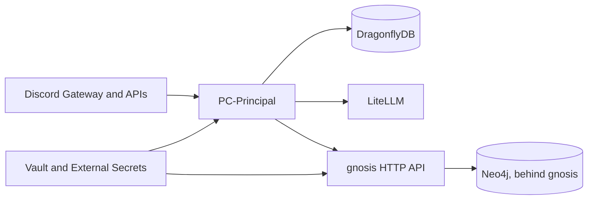
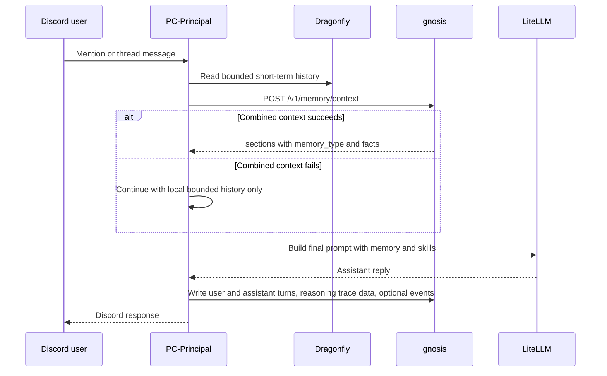

# PC-Principal

PC-Principal is the Bromigos Discord bot. It handles commands, mention and thread conversations, moderation-adjacent helpers, and memory-aware prompting while talking to `gnosis` over HTTP.

It is intentionally not a Neo4j client and not a Python SDK client.

## What it does

- Runs the Discord bot surface for Bromigos communities.
- Builds conversation prompts with local short-term history plus reviewed memory sections from `gnosis`.
- Writes user and assistant turns back to the memory gateway when memory is enabled.
- Emits structured Discord events for ingestion, including messages, reactions, topology changes, members, roles, links, and attachments.
- Records reviewed skill context and reasoning trace lifecycle data through the gateway.
- Degrades safely when the combined memory endpoint or optional dependencies are unavailable.

## Architecture



## Integration boundary

- PC-Principal is an HTTP-only client of `gnosis`.
- It does not connect to Neo4j, Bolt, or `neo4j-agent-memory` directly.
- Memory type routing stays service-owned. The bot reads what the gateway returns and does not invent its own scope policy.
- Combined memory sections prefer `memory_type` labels and fall back to legacy `source` labels only when needed.

## Conversation memory behavior

When `GNOSIS_ENABLED=true`, the conversation flow asks `gnosis` for combined context through `POST /v1/memory/context`.

- If combined recall succeeds, the bot renders service-ordered sections under `Relevant reviewed memory context:`.
- If the returned sections do not include `short_term`, the bot can still prepend bounded local short-term history from Dragonfly or in-memory history.
- If combined recall fails, the bot continues the conversation without memory context instead of calling older context routes.
- If `gnosis` is unavailable, conversation handling degrades instead of crashing the bot.

## How PC-Principal uses memory

PC-Principal is responsible for Discord context capture and prompt assembly. `gnosis` is responsible for scope policy, redaction, and durable memory decisions.

- The bot turns Discord state into a `MemoryScope`, including tenant, agent, session, user, and Discord boundary identifiers.
- Guild conversations use guild-scoped recall so same-guild graph facts can answer cross-channel activity questions; DM conversations stay private-user scoped.
- That scope is sent to `gnosis`, which decides which short-term, long-term, reasoning, and graph-backed sections are allowed to come back.
- The bot reads the combined response as labeled prompt sections, renders them in service order, and keeps reviewed skills separate from memory recall.
- If the combined endpoint is missing a `short_term` section, local bounded history from Dragonfly or in-process memory can still fill the immediate continuity gap.
- If combined recall is unavailable, the bot skips memory context rather than inventing its own memory policy.

### Combined memory request and rendering

For combined recall, the bot sends one `POST /v1/memory/context` request with the current `MemoryScope`, the active user query or message, and any request options that bound the amount of recall it wants back. `gnosis` then reads the allowed internal layers, applies scope and redaction policy, and returns prompt-safe `sections[]` entries instead of one flattened durable store.

PC-Principal consumes that response as reviewed memory context.

- It renders each returned section under `Relevant reviewed memory context:`.
- It prefers the labeled `memory_type` for section headings and falls back to legacy `source` labels when needed.
- It renders optional `facts` as deterministic lines under the matching section instead of reclassifying them locally.
- It keeps reviewed skills separate from memory sections so prompt assembly does not blur memory recall with skill guidance.

If combined memory is unavailable, the bot continues with local Dragonfly or in-process history for immediate continuity. It does not call older context routes or bypass gateway policy with client-side scope rules.

Write-back follows the same boundary.

- PC-Principal writes user and assistant turns, optional Discord events, and reasoning lifecycle records over HTTP.
- The bot never writes directly to Neo4j and never decides its own redaction rules.
- The gateway receives those writes, applies policy, and decides what becomes prompt-safe recall later.

## Prompt assembly flow



## Memory-aware prompting

The bot treats the combined memory response as labeled prompt sections.

- `short_term` covers recent continuity.
- `long_term` covers durable facts, preferences, entities, and graph-backed recall.
- `reasoning` covers prior successful tool-use summaries.
- `facts` attached to a section are rendered as deterministic `key=value` lines.
- Reviewed skills are rendered as a separate system section, not mixed into memory recall.

Reasoning traces are lifecycle records, not hidden prompt dumps. The bot records start, step, tool-call, and completion events through gateway endpoints, while the gateway keeps chain-of-thought style content out of prompt-safe recall.

## Discord ingestion posture

- Mention replies and thread chat are the visible conversation surface.
- Live ingestion is wider than the reply surface. The bot can send message, reaction, channel, thread, role, member, attachment, link, and topic events to `gnosis`.
- Attachment handling is metadata-first by default.
- Attachment byte copying is optional and stays off unless explicitly enabled.
- Ambient replies are guarded and disabled unless configured.

## Configuration

### Required secrets

- `DISCORD_BOT_TOKEN`
- `LITELLM_API_KEY`
- `GNOSIS_SERVICE_TOKEN` when `gnosis` integration is enabled

These should come from Vault or another secret manager. Helm values can wire URLs and flags, but they should not contain literal secret values.

### Key environment variables

- `DISCORD_BOT_TOKEN`
- `LITELLM_BASE_URL`
- `LITELLM_API_KEY`
- `DRAGONFLY_ADDR`
- `GNOSIS_ENABLED`
- `GNOSIS_SERVICE_URL`
- `GNOSIS_SERVICE_TOKEN`
- `GNOSIS_TENANT_ID`
- `DISCORD_HISTORY_BACKFILL_ENABLED`
- `DISCORD_HISTORY_BACKFILL_GNOSIS_BATCH_SIZE`
- `DISCORD_AMBIENT_REPLIES_ENABLED`
- `DISCORD_ATTACHMENT_COPY_ENABLED`

## Local development

```bash
go run ./cmd/pc-principal/
```

The bot can start in degraded local mode when optional services such as Dragonfly or `gnosis` are missing. Live Discord use still requires a valid `DISCORD_BOT_TOKEN`.

## Testing and verification

```bash
go test ./...
```

Important coverage points in the repo include:

- conversation prompt degradation and combined memory rendering tests under `internal/commands/`
- memory client contract coverage under `internal/memory/`
- event and backfill behavior under `internal/backfill/`, `internal/run/`, and `internal/discordevent/`

## Deployment and operations

PC-Principal is expected to run in Kubernetes with GitOps-driven config changes.

- The bot consumes `gnosis` over HTTP.
- `gnosis` remains the only component that talks to Neo4j.
- Homelab deployment follows ClusterIP plus Traefik ingress patterns on the service side, not direct bot access to the database.
- Secrets are expected to flow through Vault and External Secrets Operator.
- ArgoCD is the expected reconciler for rollout and rollback.

### Rollout

1. Land the code or Helm change in Git.
2. Let ArgoCD reconcile the `pc-principal` chart.
3. Enable `GNOSIS_ENABLED` and related flags only when the matching `gnosis` behavior is ready.
4. Keep backfill, ambient replies, and attachment copying off unless the rollout needs them.
5. Verify command handling, mention conversation flow, and one memory-backed request path.

### Rollback

1. Revert the smallest Git or Helm change.
2. Let ArgoCD reconcile.
3. If combined memory recall needs to back out, revert the bot and `gnosis` changes together so the integration boundary stays consistent.

## Health and failure behavior

- `GET /health` and `/healthz` expose bot, Discord, and Dragonfly readiness state.
- `gnosis` failures are logged and treated as degraded dependencies where possible.
- Prompt construction remains usable with local short-term history if the primary combined endpoint fails.

## Current guarantees and non-goals

### Current guarantees

- HTTP-only memory integration.
- Combined memory prompt rendering with `memory_type` awareness.
- Safe degradation when combined memory recall is unavailable.
- Structured event ingestion without requiring the bot to reply.
- Reasoning trace lifecycle writes through the gateway.

### Non-goals in this repo

- Direct Neo4j access.
- Direct `neo4j-agent-memory` SDK access.
- Client-owned memory scope filtering.
- Claiming MCP-native memory support.

## Upstream attribution

PC-Principal is a Bromigos-local Discord bot built on [discordgo](https://github.com/bwmarrin/discordgo). Its shared memory integration goes through the Bromigos `gnosis` gateway, not through direct database or SDK access.
