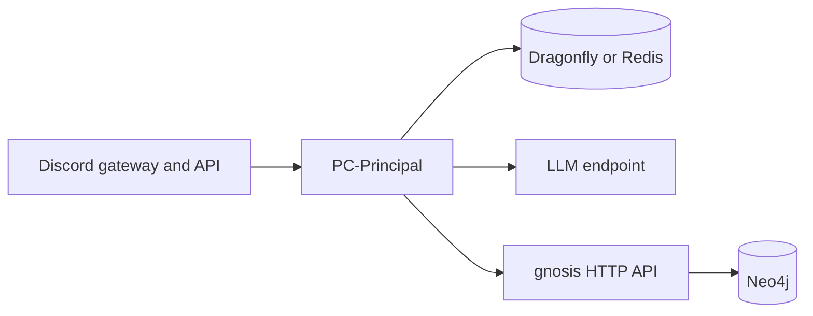
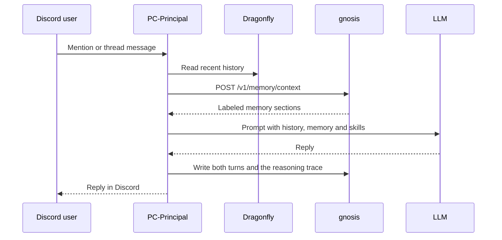

# PC-Principal

[](https://github.com/bromigos-org/PC-Principal/actions/workflows/ci-tests.yml)
[](go.mod)
[](LICENSE)

PC-Principal is the Bromigos Discord bot. It is written in Go on top of
[discordgo](https://github.com/bwmarrin/discordgo).

It chats with members through an OpenAI-compatible LLM endpoint. It remembers
conversations through [gnosis](https://github.com/bromigos-org/gnosis), the
Bromigos memory service. It also runs a few community helpers, such as
temporary voice channels and an anonymous vent channel.

> **Status: active.** The bot ships continuously from `main`. Every push to
> `main` builds a new container image, and the running bot picks it up. See
> [Build and deploy](#build-and-deploy).

## What it does

- **Conversations.** Mention the bot to talk to it. It replies with help from
  an LLM, recent channel history and recalled memory.
- **Threaded chats.** `chat <topic>` opens a thread. The bot answers every
  message in it for 24 hours after the last one. This needs Dragonfly.
- **Commands.** A small set of mention commands, listed below.
- **Temporary voice channels.** Joining the `=Join To Start Game` voice channel
  creates a personal voice channel. The bot deletes it when it empties.
- **Anonymous venting.** A post in the `vent-anonymously` forum is deleted
  and reposted by the bot. Replies in that post are reposted as "Anonymous".
  The bot forgets which posts it owns when it restarts.
- **Ambient replies.** The bot can join a conversation without being
  mentioned. This is off by default and rate-limited when on.
- **Event ingestion.** The bot sends Discord activity to gnosis as structured
  events. This covers messages, reactions, channels, threads, roles, members,
  links and attachments. It does this whether or not it replies.
- **History backfill.** On startup the bot can import older channel history
  into gnosis. This is off by default.

### Commands

Every command starts with a mention of the bot.

| Command | What it does |
|---|---|
| `@PC-Principal help` | Lists the commands. |
| `@PC-Principal ping` | Replies "Pong!". |
| `@PC-Principal hey <message>` | Asks the bot something. Same as a plain mention. |
| `@PC-Principal chat <topic>` | Starts a threaded conversation on a topic. |
| `@PC-Principal mpost #channel <message>` | Posts a message to a channel as the bot. |
| `@PC-Principal mdelete <n>` | Deletes the last `n` messages in the channel. |

A mention with no recognized command is treated as a conversation.

If `ALLOWED_ROLES` is set, only members with one of those roles get a reply
from mentions and threads. If it is empty, everyone does.

## How it works


```mermaid
flowchart LR
    Discord[Discord gateway and API]
    Bot[PC-Principal]
    Dragonfly[(Dragonfly or Redis)]
    LLM[LLM endpoint]
    Gnosis[gnosis HTTP API]
    Neo4j[(Neo4j)]

    Discord --> Bot
    Bot --> Dragonfly
    Bot --> LLM
    Bot --> Gnosis
    Gnosis --> Neo4j
```

- **Discord** delivers messages and server events to the bot.
- **The LLM endpoint** generates replies. The bot calls
  `POST <LITELLM_BASE_URL>/chat/completions` with the model `gemma4`. Any
  OpenAI-compatible endpoint works. The project uses
  [LiteLLM](https://github.com/BerriAI/litellm).
- **Dragonfly** keeps short-term state. That covers the last 40 messages of
  each channel and thread, ambient reply state and backfill cursors. History
  expires after 24 hours idle. Any Redis-compatible server works.
- **gnosis** stores and recalls long-term memory. The bot only talks to it
  over HTTP. It never connects to Neo4j itself.

### Memory boundary

The bot captures Discord context and assembles prompts. gnosis owns memory
policy. That means gnosis decides scope, redaction and what is safe to recall.

For each conversation turn the bot does the following.

1. It builds a memory scope. The scope names the tenant, agent, session, user,
   guild and channel.
2. It sends one `POST /v1/memory/context` request with that scope and the
   user's message.
3. gnosis returns labeled sections such as `short_term`, `long_term` and
   `reasoning`. The bot renders them in the order gnosis returns them, under
   `Relevant reviewed memory context:`.
4. If gnosis returns no `short_term` section, the bot adds recent history from
   Dragonfly instead.
5. After it replies, the bot writes the user turn and its own turn back to
   gnosis.


```mermaid
sequenceDiagram
    participant U as Discord user
    participant B as PC-Principal
    participant D as Dragonfly
    participant G as gnosis
    participant L as LLM

    U->>B: Mention or thread message
    B->>D: Read recent history
    B->>G: POST /v1/memory/context
    G-->>B: Labeled memory sections
    B->>L: Prompt with history, memory and skills
    L-->>B: Reply
    B->>G: Write both turns and the reasoning trace
    B-->>U: Reply in Discord
```

Guild conversations recall with guild scope. That lets the bot answer
questions about activity in other channels of the same server. Direct messages
stay scoped to the one user.

Reviewed skills are a separate prompt section. They are never mixed into
memory recall.

The bot also records reasoning traces through gnosis. A trace is a lifecycle
record of start, steps, tool calls and completion. gnosis keeps raw reasoning
text out of recall.

### When something is down

The bot degrades instead of crashing.

| Missing piece | What happens |
|---|---|
| gnosis | Replies go out without long-term memory. Writes are logged and skipped. |
| Dragonfly | History does not persist, and `chat` threads get no follow-ups. Ambient replies and backfill are skipped. |
| LLM endpoint | The bot replies with an error message in the channel. |
| `DISCORD_BOT_TOKEN` | The bot logs a warning and exits. |

## Run it locally

You need:

- Go 1.24 or later. With an older Go, prefix commands with
  `GOTOOLCHAIN=go1.24.0` to fetch the right toolchain.
- A Discord bot token. In the Discord developer portal, turn on the Message
  Content, Server Members and Presence intents.
- An OpenAI-compatible chat endpoint and its API key.
- Optionally, a Dragonfly or Redis server, and a gnosis instance.

Put your settings in a `.env` file at the repo root. The bot loads it on
startup, and git ignores it.

```bash
DISCORD_BOT_TOKEN=your-bot-token
LITELLM_BASE_URL=http://localhost:4000
LITELLM_API_KEY=your-llm-key
DRAGONFLY_ADDR=localhost:6379
```

Then start the bot.

```bash
go run ./cmd/pc-principal/
```

The bot connects to Discord and logs `Bot is now running. Press CTRL-C to
exit.` A health server also starts on port 8080. See
[Health checks](#health-checks).

## Configuration

All settings are environment variables. Booleans are on only when set to
`true`.

`ALLOWED_ROLES` is read before `.env` loads. Set it in the real environment,
not in `.env`.

### Core

| Variable | Default | Purpose |
|---|---|---|
| `DISCORD_BOT_TOKEN` | none | Discord bot token. Required. |
| `LITELLM_BASE_URL` | none | Base URL of the chat completions endpoint. |
| `LITELLM_API_KEY` | none | API key for that endpoint. |
| `DRAGONFLY_ADDR` | none | `host:port` of Dragonfly or Redis. |
| `ALLOWED_ROLES` | empty | Comma-separated role IDs allowed to talk to the bot. |

### Memory

| Variable | Default | Purpose |
|---|---|---|
| `GNOSIS_ENABLED` | `false` | Turns on gnosis recall, write-back and event ingestion. |
| `GNOSIS_SERVICE_URL` | none | Base URL of the gnosis API. |
| `GNOSIS_SERVICE_TOKEN` | none | Bearer token for gnosis. |
| `GNOSIS_TENANT_ID` | `bromigos` | Tenant the bot reads and writes under. |

Memory stays off unless all three of `GNOSIS_ENABLED`, `GNOSIS_SERVICE_URL`
and `GNOSIS_SERVICE_TOKEN` are set.

### Optional features

| Variable | Default | Purpose |
|---|---|---|
| `DISCORD_AMBIENT_REPLIES_ENABLED` | `false` | Lets the bot reply without a mention. Needs Dragonfly. |
| `DISCORD_HISTORY_BACKFILL_ENABLED` | `false` | Imports channel history into gnosis on startup. Needs Dragonfly. |
| `DISCORD_ATTACHMENT_COPY_ENABLED` | `false` | Copies attachment files to S3 storage, not just their metadata. |

### History backfill tuning

| Variable | Default |
|---|---|
| `DISCORD_HISTORY_BACKFILL_AGENT_ID` | `pc-principal` |
| `DISCORD_HISTORY_BACKFILL_MAX_CHANNELS` | `25` |
| `DISCORD_HISTORY_BACKFILL_MAX_MESSAGES_PER_CHANNEL` | `500` |
| `DISCORD_HISTORY_BACKFILL_GNOSIS_BATCH_SIZE` | `50` |
| `DISCORD_HISTORY_BACKFILL_REQUEST_DELAY` | `250ms` |
| `DISCORD_HISTORY_BACKFILL_BACKOFF` | `1s` |
| `DISCORD_HISTORY_BACKFILL_MAX_ATTEMPTS` | `3` |

### Attachment copy

These apply only when `DISCORD_ATTACHMENT_COPY_ENABLED=true`. The endpoint and
both keys are required. Without them, attachment events keep metadata only.

| Variable | Default |
|---|---|
| `DISCORD_ATTACHMENT_S3_ENDPOINT` | none |
| `DISCORD_ATTACHMENT_S3_ACCESS_KEY_ID` | falls back to `AWS_ACCESS_KEY_ID` |
| `DISCORD_ATTACHMENT_S3_SECRET_ACCESS_KEY` | falls back to `AWS_SECRET_ACCESS_KEY` |
| `DISCORD_ATTACHMENT_S3_REGION` | falls back to `AWS_REGION` |
| `DISCORD_ATTACHMENT_S3_PATH_STYLE` | `true` |
| `DISCORD_ATTACHMENT_STORAGE_PROVIDER` | `rustfs` |
| `DISCORD_ATTACHMENT_COPY_BUCKET` | `pc-principal-discord-media` |
| `DISCORD_ATTACHMENT_COPY_MAX_SIZE_BYTES` | `25000000` |
| `DISCORD_ATTACHMENT_COPY_CONTENT_TYPES` | common image, video, PDF and text types |
| `DISCORD_ATTACHMENT_COPY_TIMEOUT` | `10s` |

Keep tokens and keys in a secret manager. Never commit them.

## Test

```bash
go test ./...
```

The main test areas are listed below.

- `internal/commands/` covers prompt assembly, memory rendering and
  degradation.
- `internal/memory/` covers the gnosis client contract.
- `internal/backfill/`, `internal/run/` and `internal/discordevent/` cover
  event capture and backfill.

## Build and deploy

The `Dockerfile` builds a static binary into a small Alpine image. It exposes
port 8080.

```bash
docker build -t pc-principal .
docker run --env-file .env -p 8080:8080 pc-principal
```

CI lives in `.github/workflows/ci-tests.yml`.

- Every push and pull request to `main` runs `go test -v ./...`.
- A push to `main` that passes the tests builds and pushes
  `ghcr.io/bromigos-org/pc-principal`. It is tagged with the commit SHA and
  `latest`.

The production bot runs on Kubernetes and tracks the `latest` tag. **Merging to
`main` deploys.** Add `[skip ci]` to a docs-only commit to skip the build.

Keep new features behind their flags until gnosis is ready for them. To roll
back, revert the smallest change and push. If a memory change needs backing
out, revert the bot and gnosis together.

## Health checks

`GET /health` and `GET /healthz` on port 8080 return JSON like this.

```json
{"status": "ok", "checks": {"discord": "ready", "dragonfly": "ok"}, "checkedAt": "2026-10-09T17:00:00Z"}
```

The HTTP status is always `200` while the process is up. `status` becomes
`degraded` when Discord is not ready or Dragonfly is unreachable.

## Project layout

| Path | Contents |
|---|---|
| `cmd/pc-principal/` | Entry point. |
| `internal/run/` | Startup, Discord event handlers and the health server. |
| `internal/commands/` | Commands, conversations and prompt assembly. |
| `internal/memory/` | HTTP client for gnosis. |
| `internal/discordevent/` | Turns Discord events into gnosis events. |
| `internal/backfill/` | History backfill worker. |
| `internal/ambient/` | Ambient reply rules and rate limits. |
| `internal/llm/` | Chat completions client. |
| `internal/store/` | Dragonfly-backed conversation history. |
| `internal/preflight/` | Startup checks for missing intents and permissions. |

## Contributing and security

Bug reports and feature requests go in GitHub issues. Report security problems
privately, as described in [SECURITY.md](SECURITY.md). Everyone taking part
follows the [Code of Conduct](CODE_OF_CONDUCT.md).

## License

Apache License 2.0. See [LICENSE](LICENSE).
